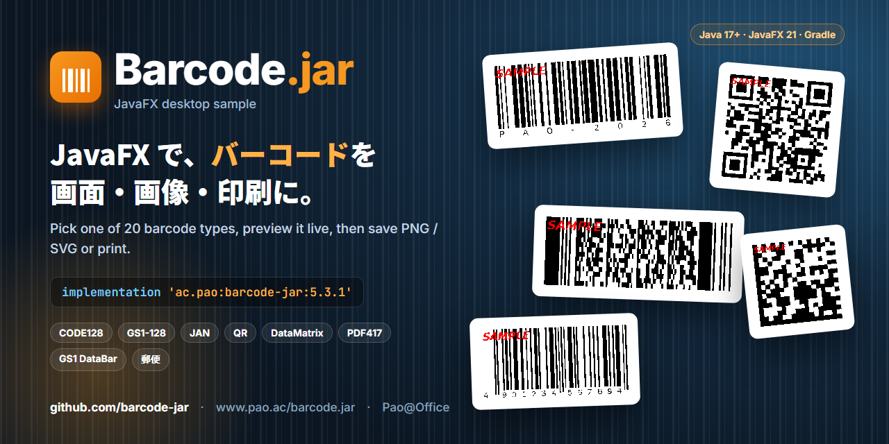
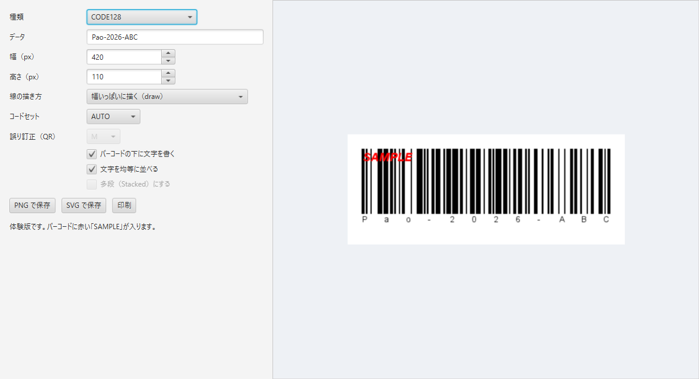
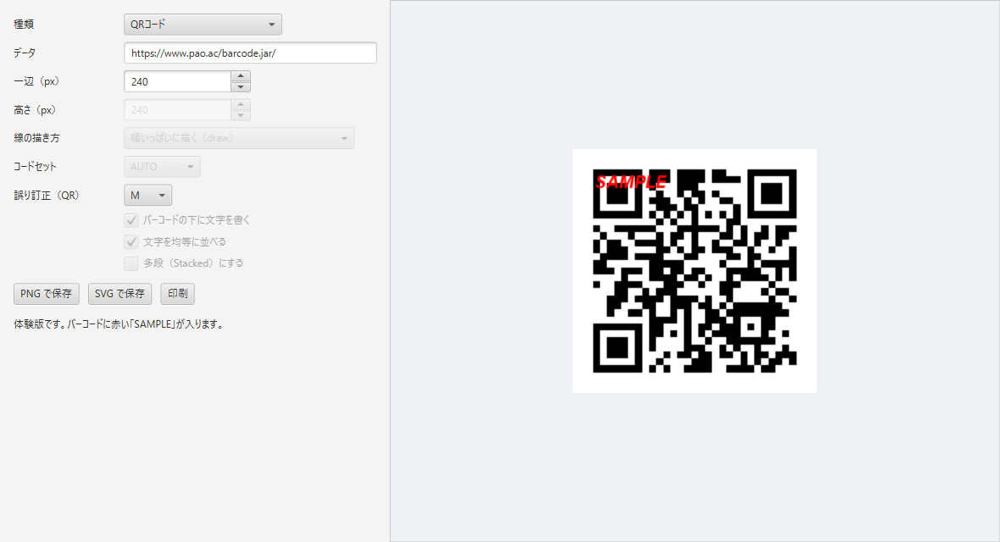
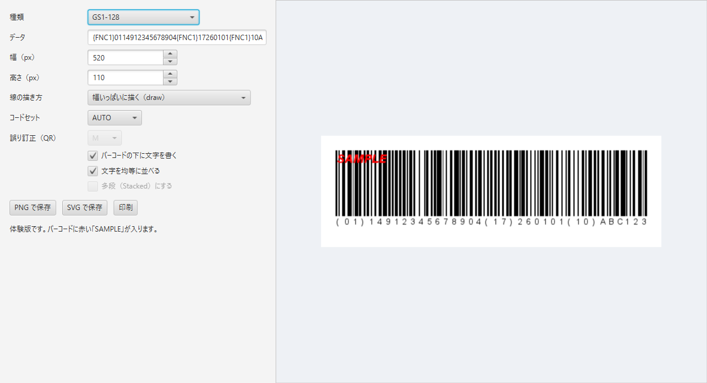

<p align="center">
  
</p>

<p align="center">
  <a href="https://www.pao.ac/barcode.jar/"><b>製品ページ</b></a> ·
  <a href="https://central.sonatype.com/artifact/ac.pao/barcode-jar"><b>Maven Central</b></a> ·
  <a href="https://github.com/barcode-jar"><b>ほかのサンプル</b></a> ·
  <a href="#english">English</a>
</p>

# Barcode.jar JavaFX サンプル

JavaFX のデスクトップアプリで、**20 種類のバーコード**をその場で描き、PNG・SVG に保存したり、印刷したりするサンプルです。種類やデータ、大きさを変えると、すぐにプレビューが変わります。

<p align="center"></p>

## 動かし方

Java 17 以上が必要です（JavaFX は Gradle が自動で取ってきます）。

### Java の版とサンプル

| Java の版 | 画面（デスクトップ） | Web | 入手先 |
|---|---|---|---|
| **Java 17 以上** | JavaFX 21.0.6（[javafx](https://github.com/barcode-jar/javafx)） | Spring Boot 3.5.16（[springboot](https://github.com/barcode-jar/springboot)） | GitHub・体験版 ZIP（barcode.jar.17.zip） |
| **Java 8・11** | Swing | Spring Boot 2.7.18 | [体験版 ZIP](https://www.pao.ac/barcode.jar/)（barcode.jar.8.zip・barcode.jar.11.zip） |

Java 8・11 では JavaFX が動かないため、同じ内容の Swing のサンプルを体験版 ZIP に入れています。

```bash
git clone https://github.com/barcode-jar/javafx.git
cd javafx
./gradlew run          # Windows は gradlew.bat run
```

## できること

| 機能 | 内容 |
|---|---|
| 20 種類のバーコード | CODE128・GS1-128・CODE39・CODE93・NW7・ITF・JAN-13・JAN-8・UPC-A・UPC-E・Matrix 2of5・NEC 2of5・GS1 DataBar（標準型・限定型・拡張型）・コンビニ収納用・QR コード・DataMatrix・PDF417・郵便カスタマバーコード |
| 線の描き方 | 幅いっぱいに描く（`draw`）・バーを整数ドットにそろえる（`drawDirect`）・いちばん細いバーの幅を指定（`drawDelicate`） |
| 設定 | 大きさ、文字の表示と均等割付、CODE128 のコードセット、QR の誤り訂正、DataBar の多段 |
| 出力 | PNG で保存・SVG で保存・印刷 |

<p align="center">
  
  
</p>

## コードの読み方

| ファイル | 内容 |
|---|---|
| [`BarcodeRenderer.java`](src/main/java/sample/BarcodeRenderer.java) | Barcode.jar で描く部分。`Graphics2D` に描く・PNG の画像を作る・SVG の文字列を作る。**JavaFX に依存しない**ので、このまま業務のプログラムに持っていけます |
| [`BarcodeApp.java`](src/main/java/sample/BarcodeApp.java) | JavaFX の画面。入力をまとめて `BarcodeRenderer` に渡し、結果を表示・保存・印刷します |
| [`BarcodeKind.java`](src/main/java/sample/BarcodeKind.java) | 種類ごとの名前・データの例・既定の大きさ |

いちばん短い使い方は、`Graphics2D` に描くだけです。

```java
Code128 bar = new Code128(graphics2d);       // どの Graphics2D にも描ける（画像・印刷・PDF）
bar.draw("Pao-2026-ABC", 20, 20, 420, 110);  // データ, X, Y, 幅, 高さ（px）

String svg = new QRCode().writeSVGToString("https://www.pao.ac/", 0, 0, 240, 240);
```

依存関係は 1 行です。

```gradle
implementation 'ac.pao:barcode-jar:5.3.1'
```

## 体験版について

Maven Central の `ac.pao:barcode-jar` は**体験版**で、バーコードに赤い「SAMPLE」の印が入ります。QR コードなどは、印が重なって読み取れない場合があります。[製品版](https://www.pao.ac/barcode.jar/)をご購入いただくと、印のない出力になります。

サンプルのコードは MIT ライセンスです（[LICENSE](LICENSE)）。Barcode.jar 本体は [Barcode.jar の使用許諾](https://www.pao.ac/barcode.jar/)に従います。

---

<a id="english"></a>

# Barcode.jar JavaFX sample (English)

A JavaFX desktop app that draws **20 barcode types** live and saves them as PNG or SVG, or prints them. Change the type, data or size and the preview updates immediately.

```bash
git clone https://github.com/barcode-jar/javafx.git
cd javafx
./gradlew run          # gradlew.bat run on Windows
```

Requires Java 17 or later; Gradle downloads JavaFX automatically. For Java 8 / 11, a Swing version of this sample is in the [trial ZIP](https://www.pao.ac/barcode.jar/).

- `BarcodeRenderer.java` — the Barcode.jar part: draw on `Graphics2D`, build a PNG image, or an SVG string. It has no JavaFX dependency, so you can copy it into your own code.
- `BarcodeApp.java` — the JavaFX screen (type, data, size, line mode, options, preview, save, print).
- Dependency: `implementation 'ac.pao:barcode-jar:5.3.1'`

`ac.pao:barcode-jar` on Maven Central is the **trial edition**: barcodes carry a red "SAMPLE" mark (2D codes such as QR may not scan because of it). The [licensed edition](https://www.pao.ac/barcode.jar/) has no mark. The sample code is MIT licensed.

<sub>© Pao@Office</sub>
